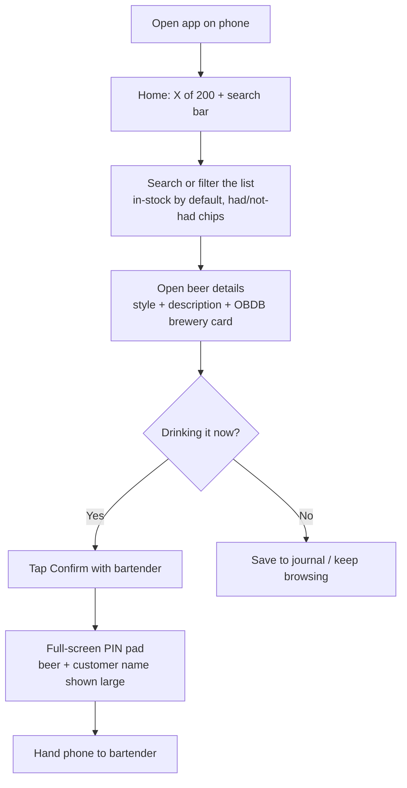
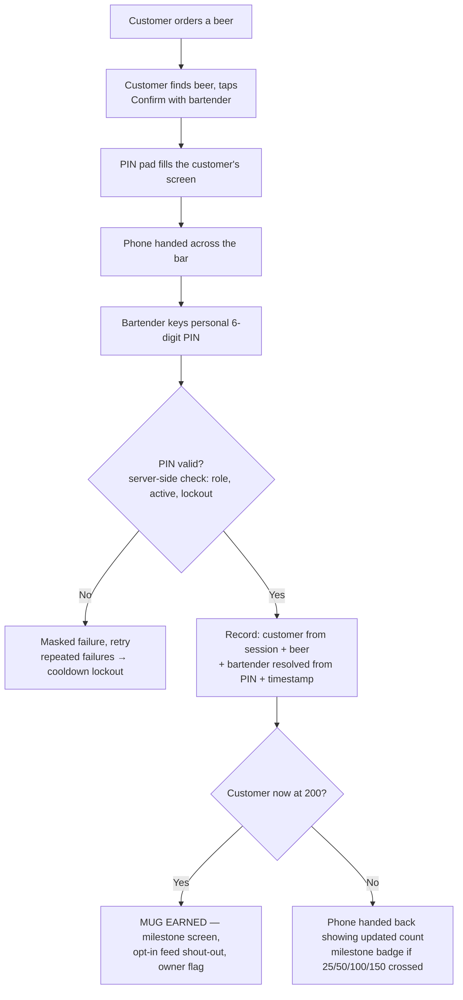
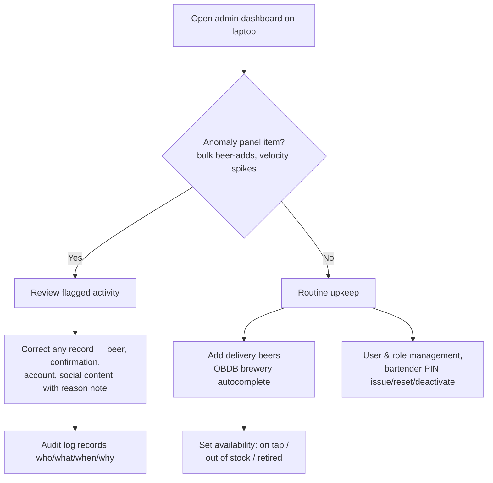
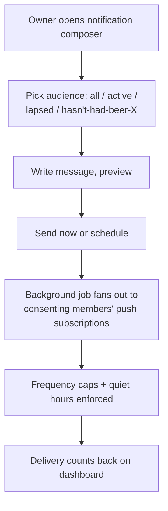
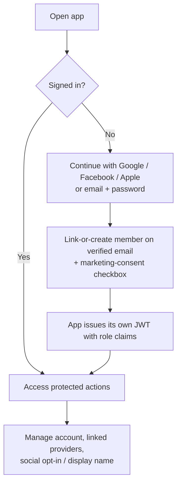
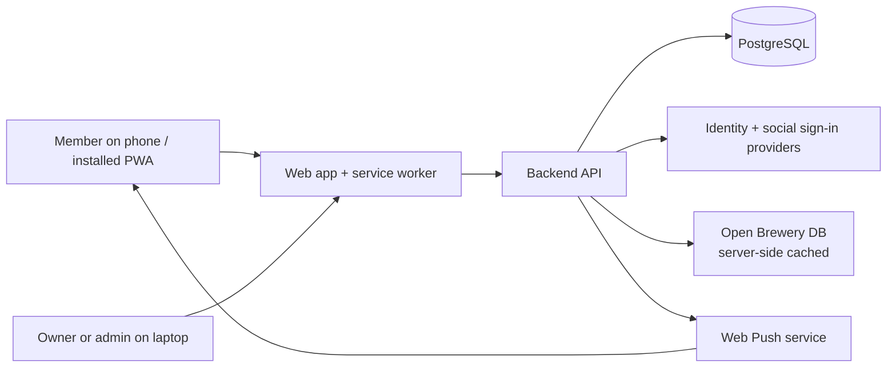

# Product Flow Diagram

## 1. Mobile customer flow (find → read → confirm)

## 2. Confirmation flow (one device — the customer's phone)

## 3. Laptop admin flow

## 4. Owner push-notification flow

## 5. Account flow

## 6. High-level system flow

