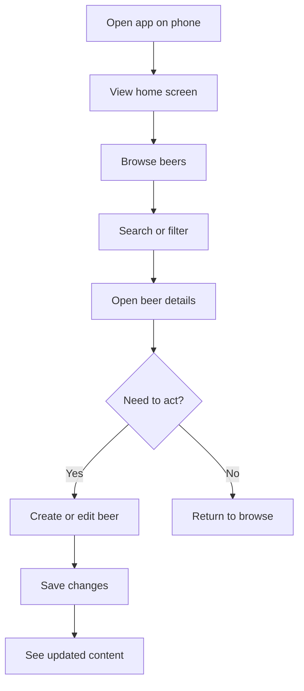
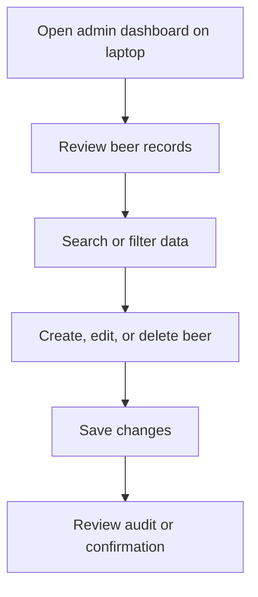
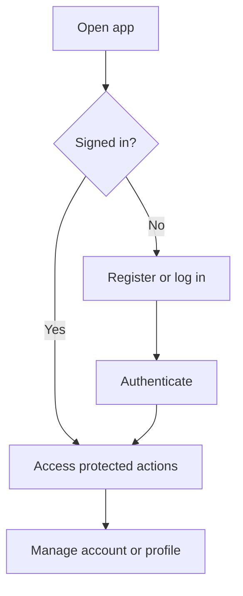
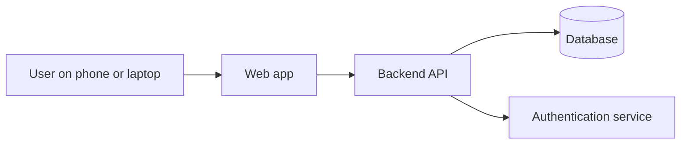

# Product Flow Diagram

## 1. Mobile user flow

```mermaid
flowchart TD
    A[Open app on phone] --> B[View home screen]
    B --> C[Browse beers]
    C --> D[Search or filter]
    D --> E[Open beer details]
    E --> F{Need to act?}
    F -->|Yes| G[Create or edit beer]
    F -->|No| H[Return to browse]
    G --> I[Save changes]
    I --> J[See updated content]
```

## 2. Laptop admin flow

```mermaid
flowchart TD
    A[Open admin dashboard on laptop] --> B[Review beer records]
    B --> C[Search or filter data]
    C --> D[Create, edit, or delete beer]
    D --> E[Save changes]
    E --> F[Review audit or confirmation]
```

## 3. Account flow

```mermaid
flowchart TD
    A[Open app] --> B{Signed in?}
    B -->|No| C[Register or log in]
    B -->|Yes| D[Access protected actions]
    C --> E[Authenticate]
    E --> D
    D --> F[Manage account or profile]
```

## 4. High-level system flow

```mermaid
flowchart LR
    U[User on phone or laptop] --> UI[Web app]
    UI --> API[Backend API]
    API --> DB[(Database)]
    API --> AUTH[Authentication service]
```
