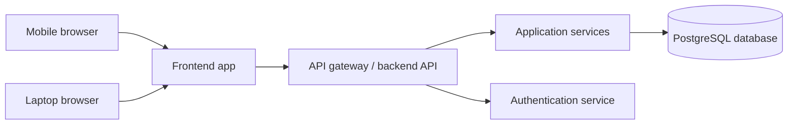

# Technical Architecture Plan

## 1. Recommended stack

### Frontend
- Next.js or React with Vite
- TypeScript
- Responsive UI components
- State management with React Query or Redux Toolkit

### Backend
- ASP.NET Core Web API
- Entity Framework Core
- PostgreSQL
- ASP.NET Core Identity for authentication

### Infrastructure
- AWS hosting
- RDS for PostgreSQL
- S3 and CloudFront for frontend assets if needed
- App Runner or ECS for API hosting
- CloudWatch for monitoring

## 2. Architecture goals

- Clear separation between frontend and backend
- API-first design
- Mobile-first responsive UI
- Easy future expansion
- Low-friction deployment on AWS

## 3. Proposed system architecture

## 4. Development approach

- Build the API first around core beer entities
- Expose REST endpoints for beer CRUD
- Build frontend screens against the API
- Add auth and admin roles once core flows are stable

## 5. Deployment approach

- Frontend deployed to a static hosting service or CDN
- Backend deployed as a managed container or web service
- Database hosted in managed RDS
- Environment variables managed securely

## 6. First milestone

The first milestone should deliver:
- beer listing
- beer detail page
- create/edit/delete beer
- basic login and auth
- mobile-friendly UI
