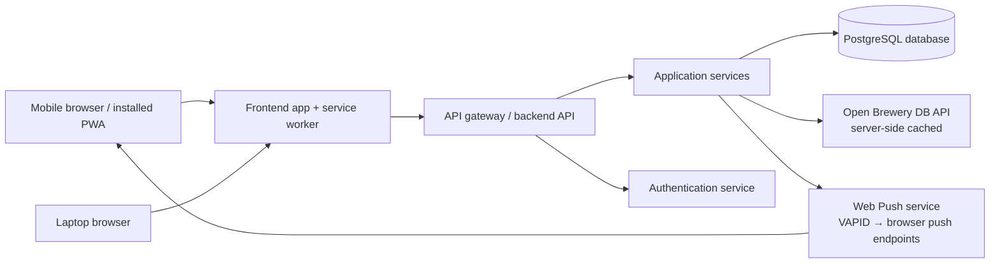

# Technical Architecture Plan

## 1. Recommended stack

### Frontend
- Next.js or React with Vite
- TypeScript
- Responsive UI components
- State management with React Query or Redux Toolkit

### Backend
- ASP.NET Core Web API
- Entity Framework Core
- PostgreSQL
- ASP.NET Core Identity for authentication

### Infrastructure
- AWS hosting
- RDS for PostgreSQL
- S3 and CloudFront for frontend assets if needed
- App Runner or ECS for API hosting
- CloudWatch for monitoring

## 2. Architecture goals

- Clear separation between frontend and backend
- API-first design
- Mobile-first responsive UI
- Easy future expansion
- Low-friction deployment on AWS

## 3. Proposed system architecture

## 4. Development approach

- Build the API first around core beer entities
- Expose REST endpoints for beer CRUD
- Build frontend screens against the API
- Add auth and admin roles once core flows are stable
- Add a BeerConfirmation entity (customer, beer, tavern, confirming bartender, timestamp) — this is the digital replacement for the bartender's paper initials, and drives the customer's progress count
- Include a Tavern/Location entity from the start (even with a single row for now) so the schema doesn't need a breaking migration if a second tavern is added later

## 4.1 Bartender PIN confirmation on the customer's phone (decided July 2026)

**The one-device rule: everything happens on the customer's phone.** There is no bar
tablet and no bartender confirmation screen. The customer finds the beer, taps "Confirm
with bartender," and hands their phone across the bar; the bartender types their
**personal 6-digit PIN** on the customer's phone. The customer's session identifies the
customer; the PIN identifies and authorizes the bartender — the digital equivalent of
initialing the customer's own paper sheet.

- **API contract**: `POST /api/confirmations` takes `{beerId, pin}`, authenticated as the
  *customer* (JWT). The server resolves the PIN to a staff user, validates role, active
  status, and lockout, then writes the `BeerConfirmation` with `ConfirmedByUserId` set to
  the PIN's owner. The customer id comes from the session, never the request body. Design
  the Sprint 1 endpoint with the `pin` field in mind even if PIN validation lands in
  Sprint 2.
- **`StaffPin` entity**: `UserId`, `PinHash`, `IsActive`, `UpdatedAt`, `FailedAttempts`,
  `LockedUntil`. One active PIN per staff user, unique across active staff (the server
  resolves identity from the PIN alone, so two bartenders can't share a code).
- **PINs are credentials**: 6 digits, hashed with ASP.NET Core Identity's
  `PasswordHasher`, never stored on or returned to the client, never logged. Validated
  server-side only.
- **Threat model — the PIN is typed on an untrusted device**, so:
  - The PIN pad masks input; no autofill, no client-side persistence.
  - Failed-attempt lockout runs on **two axes**: per-PIN (five consecutive failures locks
    that bartender's PIN for a cooldown) and per-customer-account (repeated failures from
    one customer's session throttle that account's confirmation flow — nobody sits and
    brute-forces from their own barstool).
  - **Velocity and anomaly checks** (see §4.5): confirmations-per-customer-per-hour cap,
    off-hours confirmations flagged, per-bartender pattern outliers surfaced to the owner.
    A shoulder-surfed PIN produces a detectable pattern even though it can't be prevented.
  - Accepted residual risk: a determined regular could memorize a bartender's PIN. The
    paper sheet had the same trust model (anyone could forge initials); the app adds
    attribution, timestamps, and anomaly flags the paper never had. Periodic PIN rotation
    (owner policy) bounds the exposure window.
- **Lifecycle**: owner/admin issues and resets PINs from user management; staff change
  their own PIN from their own account on first use; deactivating a staff account
  deactivates the PIN everywhere, instantly.
- **Corrections and the mug (decided 2026-07-15, #15)**: an admin void removes the
  confirmation (freeing the beer to be confirmed again) and writes a `ConfirmationAudit`
  row — actor, timestamp, required reason, and the original record's data including the
  beer name at void time. No silent deletes. **Mug-earned is permanent once stamped**: a
  correction that drops an earned customer back below 200 does not revoke the
  `MugAward` — the award is written exactly once (#14) and never recomputed from counts.
  Rationale: the physical mug may already be in the customer's hands, and revoking a
  milestone over a staff data-entry fix punishes the wrong person. A formal revoke path
  (fraud cases) is Admin Experience scope if it's ever needed.
- **Alternatives explored** (all customer-phone-only, documented in
  `PERSONAS_AND_USAGE.md` §6): TOTP-style rotating bartender code (stronger, but
  reintroduces a bartender device to read); bartender-approves-from-own-phone queue
  (rejected as primary — bartenders won't watch a queue mid-shift — but cheap to add
  later as an opt-in); Web NFC staff tap (not viable — no iPhone browser support).

### Open architecture questions surfaced 2026-07-23 (not yet decided — flagged for future design)

Two real gaps came out of a 2026-07-23 product/UX review (`USABILITY_TESTING.md`),
neither resolved yet:

- **Bartender identity model may not need a full account at all.** Today `StaffPin`
  hangs off a full `ApplicationUser` (Identity account, email/password, the works),
  requiring a bartender to have registered like any customer before an admin can
  promote+PIN them. The user has floated a lighter model where the bartender stays
  "out of the loop" entirely — no login, no self-service — and an admin directly
  creates a staff record + PIN with no underlying Identity account, using the
  bartender's birthday (`MMDDYYYY`, 8 digits) as an easy-to-remember PIN. This is a
  bigger change than it looks: PIN length is hardcoded to 6 digits throughout
  (`StaffPin`, lockout logic, the PIN pad UI), and decoupling `StaffPin` from
  `ApplicationUser` touches `ConfirmedByUserId`'s FK and every place that resolves a
  bartender's display name from their user record. Needs a real design pass before
  it's ticketed — not a quick patch.
- **Mid-shift availability update has no clean answer under the one-device rule.**
  Only `[Authorize(Roles = "Admin")]` can flip a beer's availability (`PATCH
  /api/beers/{id}/availability`), but nobody physically at the bar when a keg kicks
  necessarily has that role, and the one-device rule means a bartender has no device
  of their own to act from anyway. Three options are all still live and may end up
  layered rather than mutually exclusive: (a) a narrow availability-only permission
  for Bartenders — but this requires the bartender to actually be an authenticated
  user, which is in direct tension with the account-model question above; (b) house
  policy — bartender tells the admin by text/call, admin updates remotely; (c) a
  customer-facing "flag as unavailable" crowd-sourced report surfaced to the admin as
  a lightweight alert, independent of bartender auth entirely. Resolving the account-
  model question first will determine whether (a) is even feasible.

## 4.2 Push notifications (planned July 2026)

Standard Web Push, no native app required:

- **Frontend becomes an installable PWA**: web app manifest + service worker. The service
  worker receives push events and shows notifications. (iOS caveat: Safari supports web
  push only for PWAs added to the home screen, iOS 16.4+ — the UI should coach members
  to install.)
- **`PushSubscription` entity**: `UserId`, `Endpoint`, `P256dh`, `Auth`, `CreatedAt` —
  one row per browser/device the member opted in from; pruned when the push service
  returns `410 Gone`.
- **VAPID keys** identify the server to browser push services; private key lives in
  environment config (same handling as the JWT signing key — never committed).
- **Two senders, one pipeline**: (a) *owner-composed* sends from the dashboard with
  audience targeting (all / active / lapsed / hasn't-had-beer-X), and (b) *automated*
  triggers (new beers batched, milestone nudges, win-back after N weeks idle). Both go
  through one notification service with per-member frequency caps and quiet hours.
- **Delivery is background work**: a queued job (hosted service) fans out to
  subscriptions so a send to every member never blocks an API request.

## 4.3 Social layer (planned July 2026 — opt-in by design)

- **`MemberProfile`**: `UserId`, `DisplayName`, `IsPublic` (default **false**),
  `JoinedAt`. Nothing about a member appears in any social surface until they opt in
  and choose a display name.
- **`ActivityEvent`**: `Id`, `UserId`, `Type` (MilestoneReached, MugEarned,
  ChallengeCompleted, NewBeerAdded), `Payload` (JSON), `CreatedAt`. The feed is
  generated *by the system from real progress events* — members don't post free text,
  which keeps moderation load near zero.
- **`Cheer`**: `ActivityEventId`, `UserId`, `CreatedAt` — one tap of encouragement,
  unique per member per event.
- **Leaderboard and communal stats are queries, not tables**: rank opted-in members by
  confirmed count; the "bar has drunk N beers this year" widget is an aggregate over
  `BeerConfirmation`.
- **Moderation hooks**: admin can rename/mute a display name and hide an event.

## 4.4 Rotating inventory & catalog scale (planned July 2026)

The catalog will grow well past 200 rows as beers rotate; availability is data, deletion
is not the mechanism:

- **`Beer.Availability`** enum: `OnTap`, `Available` (bottle/can), `OutOfStock`,
  `Retired`. Search and browse default to in-stock beers; admin and member history can
  see everything.
- **Confirmations are permanent**: a beer leaving the list never subtracts from any
  member's progress. Retiring hides a beer from default search; it never cascades.
- **List/search endpoints are paginated and filtered server-side** from the start —
  GET-all does not survive a growing catalog on a phone connection.

## 4.5 Anomaly detection & operational alerts (planned July 2026)

One lightweight rules engine watching two write paths, alerting the owner and admin:

- **Confirmation anomalies** (protects the PIN trust model): more than N confirmations
  for one customer within an hour; confirmations outside business hours; a bartender's
  confirmation pattern diverging sharply from peers. Flags appear on the owner
  dashboard's anomaly panel, attributed per-bartender and per-customer.
- **Catalog anomalies** (guardrail on adding beers): an unusually large number of beers
  added in a short window fires an immediate notification to both owner and admin —
  "this is not normal behavior and might need a look." A delivery-day batch is normal;
  a large off-hours burst suggests a compromised admin account or a runaway import.
  The alert is informational — nothing is auto-blocked or rolled back — and the catalog
  audit trail (who added what, when) supports deliberate cleanup.
- **Implementation shape**: thresholds in config (per-tavern later), checks run in the
  same background job pipeline as push delivery, alerts delivered as push + a persistent
  dashboard item so they can't be missed or lost.

## 4.6 Social sign-in (planned July 2026 — options researched, recommendation below)

Goal: members sign in with existing social accounts (lower signup friction at the bar —
nobody wants to invent a password on a barstool), and the bar gains verified contact/
profile data for targeted marketing.

**Recommendation: ASP.NET Core Identity external login providers, added to the existing
setup.** Identity is already wired with roles and JWT issuance; external providers slot
into its built-in `AspNetUserLogins` table, cost nothing, and add no vendor dependency.

- **Providers for v1**: Google and Facebook (first-party ASP.NET Core packages), plus
  Apple via the community `AspNet.Security.OAuth.Apple` package (the
  `AspNet.Security.OAuth.Providers` collection covers dozens more if ever needed).
  Email/password stays as the fallback.
- **Flow with the React SPA + JWT**: the SPA sends the user to the API's challenge
  endpoint → provider OAuth dance → callback links-or-creates the local Identity user
  (matching on verified email) → the API issues *its own* JWT with role claims, exactly
  as it does for password logins today. The external provider proves identity; the app's
  existing token pipeline stays the single authority. Account-linking UI lets one member
  attach several providers to one progress record — critical, since progress must never
  fork across login methods.
- **Hosted alternatives considered** (worth revisiting if OAuth callback handling proves
  painful or a multi-tavern future arrives): Auth0 (free to 25k monthly active users),
  Clerk (10k MAU, best React developer experience), Firebase Auth and AWS Cognito (50k
  MAU — Cognito aligns with the AWS deployment plan but has notoriously poor developer
  experience). All add a vendor and a second user store to reconcile with Identity's
  roles/PINs, which is why self-hosted Identity providers win for a single tavern.
- **Marketing data — honest scoping**: basic scopes yield a verified email, display name,
  and avatar. That is the marketing win: a deliverable contact plus lower-friction signup
  (more members captured). Deeper social-profile scopes (age range, location, likes)
  require provider app review and privacy justification — not worth it; the app's own
  behavioral data (favorite styles, visit cadence, progress, lapsed status) is far better
  targeting signal and already planned for owner analytics. Requirements that come with
  this: an explicit marketing-consent checkbox at signup (store the consent), a privacy
  policy page, and a data-deletion path (Facebook requires a deletion callback for app
  approval).

## 4.7 My Beers: ratings, want list, personal stats (planned July 2026)

The customer's personal layer over their confirmation history — completed list, rankings,
a want-to-have list, and beer-nerd visualizations.

- **`BeerRating` entity**: `UserId`, `BeerId`, `Rating` (1–5), `UpdatedAt`; unique per
  user+beer. **A rating requires an existing `BeerConfirmation`** for that user+beer —
  you rank what you've verifiably had, which keeps rankings tied to the club's integrity.
  Private by default; anonymized averages feed owner analytics.
- **`WantListItem` entity**: `UserId`, `BeerId`, `AddedAt`; unique per user+beer.
  Two side-effects wire it into existing systems:
  - *Confirmation check-off*: writing a `BeerConfirmation` resolves any matching
    want-list item for that customer automatically.
  - *On-tap trigger*: when an admin flips a beer's `Availability` to on-tap, members with
    that beer on their want list get a targeted push ("*Beer X* you wanted is on tap
    tonight") through the §4.2 pipeline, subject to its frequency caps.
- **`GET /api/me/stats`** — one aggregate endpoint, computed server-side from
  `BeerConfirmation`/`BeerRating` joined with the beer's style/ABV metadata (depends on
  the `Beer` entity growth planned in §6): cumulative progress over time, style-family
  breakdown, ABV distribution, rating distribution + average rating by style,
  explored-vs-remaining by style. One request paints the whole My Stats screen.
- **Charts render client-side and lightweight** — simple SVG components over the stats
  payload; no heavy charting dependency required for v1.
- **Owner aggregates**: anonymized average rating per beer and want-count per beer
  surface on the owner dashboard as purchasing signals, and want-count powers the
  composer's targeting ("members who want beer X").

## 5. Deployment approach

- Frontend deployed to a static hosting service or CDN
- Backend deployed as a managed container or web service
- Database hosted in managed RDS
- Environment variables managed securely

## 6. External integrations

### Data-sourcing principle (stated July 2026): auto-enrich first, manual entry as fallback

The product goal is to give customers **cool beer data — the things beer nerds love**:
ABV, IBU, style and style family (ale/lager class), a real description, and brewery
provenance (who makes it, where, what kind of operation, website). The staffing goal is
that **bartenders and the owner should not have to type beer information** — with a large
rotating list, manual data entry is the failure mode that makes the catalog go stale.

So the rule for every beer-data field: **source it from an open project first; keep
manual entry available as the fallback and the override.** Concretely:

- Brewery-level fields → Open Brewery DB (below): autocomplete on add, zero typing.
- Beer-level fields (style, ABV, IBU, description) → Catalog.beer (below, pending the
  hit-rate spike): search-and-pre-fill on add, admin verifies rather than types.
- Style-level education (what *is* a saison?) → a candidate later layer: open BJCP-style
  guideline datasets exist on GitHub and could give every style a one-paragraph primer on
  the beer detail page, independent of per-beer API hit rates. Unscoped; listed so the
  idea isn't lost.
- Whatever no source can fill, the admin form accepts by hand — the option to add/edit
  manually always exists, it's just never the default workflow. Auto-sourced values stay
  admin-editable (the tavern's list is the source of truth, and sources can be wrong).

This also implies the `Beer` entity grows beyond its current
`Name/Brewery/Style/Description`: add `Abv`, `Ibu`, structured style metadata (family,
ale/lager class), the OBDB brewery id (§ below), an optional Catalog.beer id, and
`Availability` (§4.4) — plan the migration once, not field-by-field.

### Open Brewery DB (scoped July 2026)

Free, no-auth brewery directory at `api.openbrewerydb.org/v1/breweries`. **Verified: it is
breweries-only — there is no beer-level endpoint** (no styles, ABV, or descriptions), so it
cannot supply beer data. Its two jobs, both about eliminating admin data entry on the
*brewery* half of a record and giving customers real provenance info:

- **Admin autocomplete**: the add/edit-beer form searches OBDB by brewery name; selecting a
  result stores the OBDB brewery id and fills name/type/city/state/website — consistent,
  real data instead of free-typed text. The tavern's list remains the source of truth for
  the beers themselves.
- **Customer enrichment**: the beer detail page renders a brewery card (type, location,
  website) from the linked OBDB record.
- **Server-side caching is mandatory**: the API proxies and caches OBDB responses (stale
  data is fine — breweries rarely move) so the app neither hammers OBDB nor goes down with
  it.

### Catalog.beer (researched July 2026 — candidate for beer-level pre-fill)

https://catalog.beer — "The Internet's Beer Database": ~60,000 beers / ~6,800 brewers,
free under CC BY 4.0 ("free to use, free to build on"; attribution required, so the app
needs a "Beer data from Catalog.beer" credit line where its data appears).

- **This fills the exact gap OBDB can't**: its beer object carries `name`, `description`,
  `style` (with structured `style_id`, `parent` family, and ale/lager `class`), `abv`,
  `ibu`, plus a nested brewer object, and `cb_verified`/`brewer_verified` quality flags.
- **API mechanics**: REST over HTTPS with an API key (Basic auth, key as username; free
  account). Default limit is **1,000 requests/month** — comfortably enough if calls
  happen only at admin add/edit time and responses are cached server-side (same caching
  service as OBDB), and never in the customer's request path.
- **Intended use — pre-fill, not source of truth**: when the admin adds a beer, search
  Catalog.beer by name to pre-fill style/ABV/IBU/description for the admin to verify and
  edit. The tavern's list remains the source of truth (same rule as OBDB); the community-
  contributed data is a typing-saver, not an authority — prefer `cb_verified` results.
- **Before committing: run a hit-rate spike** — search a sample of the tavern's actual
  ~200 list against it. If most of the list isn't found (small/local breweries are the
  likely misses), the integration isn't worth its complexity and admin entry stays manual
  with OBDB brewery autocomplete only.

> **Spike result (2026-07-21, #31) — GO.** Ran the real Catalog.beer API (an account was
> created for this spike; the key lives only in an untracked `.env` / `CATALOG_BEER_API_KEY`,
> never committed) against the 8 beers in the tavern's seeded list, combining beer name +
> brewery name per query (the same shape an admin add-beer search naturally produces):
> **6/8 clear name+brewery matches** (60 Minute IPA/Dogfish Head, Guinness Draught/Guinness,
> Fat Tire/New Belgium, Pilsner Urquell/Plzeňský Prazdroj, Duvel/Duvel Moortgat, Pale Ale/
> Sierra Nevada), **1/8 close-but-not-exact** (Hefeweizen/Weihenstephaner — the brewery's
> real entry is filed as "Hefeweissbier," a recognizable synonym an admin would confirm),
> and **1/8 clean miss** (Oatmeal Stout/Samuel Smith — the brewery exists in the dataset,
> that specific beer doesn't). Interestingly the misses were well-known European breweries
> rather than the "small/local" ones this doc predicted — Catalog.beer's coverage skews
> American craft/macro, but is broad enough that most real-world beer names resolve.
> `cb_verified` was `false` on every result in this sample (a home-cooked, unmoderated
> catalog — verification is the exception, not the norm; treat it as a nice-to-have sort
> signal, not a quality gate). **Decision: integrate.** `ICatalogBeerService` (server-side
> cached, same pattern as OBDB) added in the same story; `BeerForm.jsx`'s Name field
> triggers a debounced Catalog.beer search, and selecting a result pre-fills style/ABV/
> IBU/style-family/class/description with a CC BY 4.0 attribution line — the admin verifies
> and can always override, per the auto-enrich-first/manual-fallback principle above.

### beer.db / openbeer.github.io (researched July 2026 — rejected)

Public-domain beer/brewery dataset with the right shape on paper (beer name, ABV, style,
brewery), but the project is dormant: most of its GitHub repos were last touched
2015–2018 (US data briefly in 2024), and its hosted API/admin ran on Heroku's
long-discontinued free tier. Stale craft-beer data is close to worthless for a rotating
tap list. Not integrating; noted here so it isn't re-researched later.

## 7. First milestone

The first milestone should deliver:
- beer listing
- beer detail page
- create/edit/delete beer
- basic login and auth
- mobile-friendly UI
